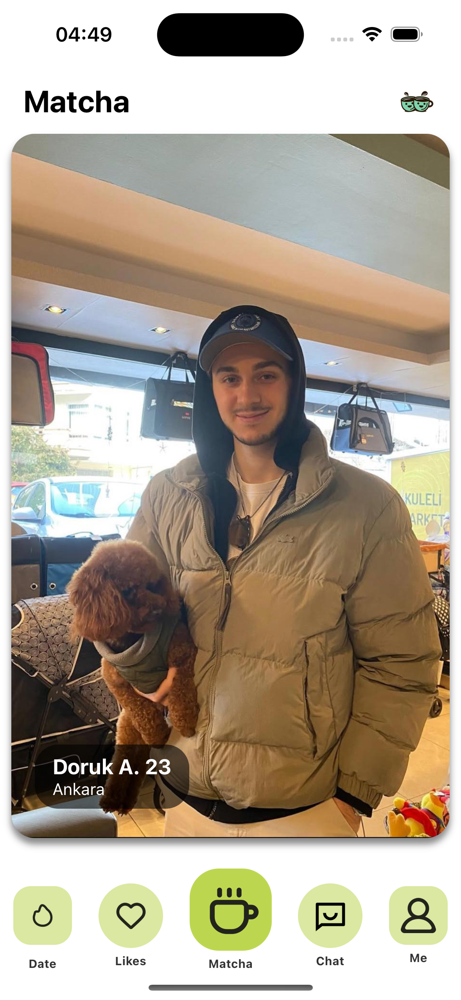
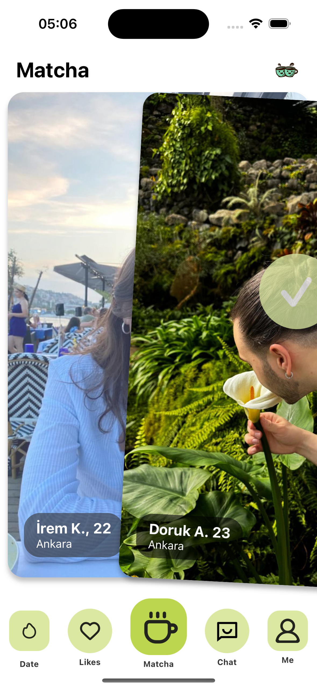
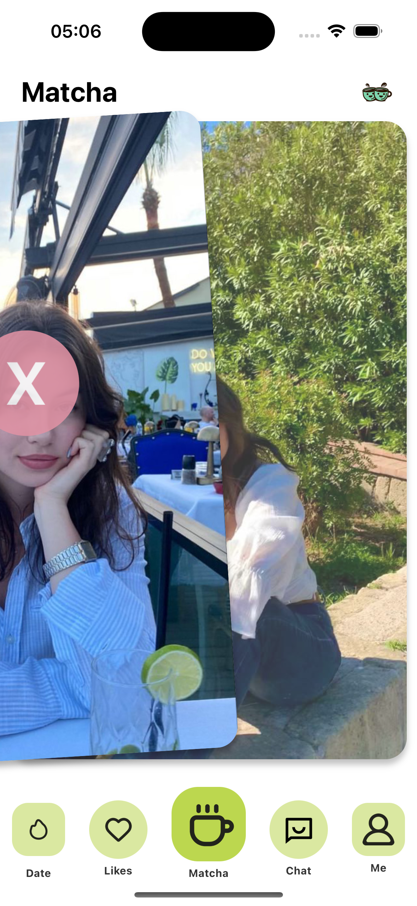
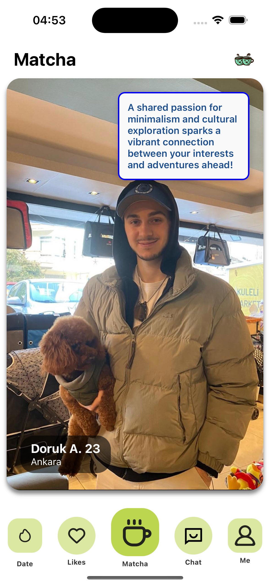
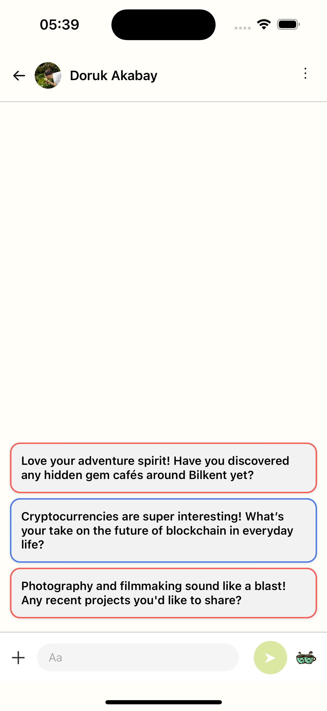
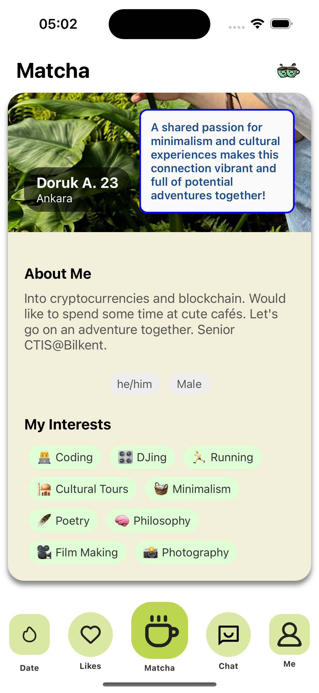
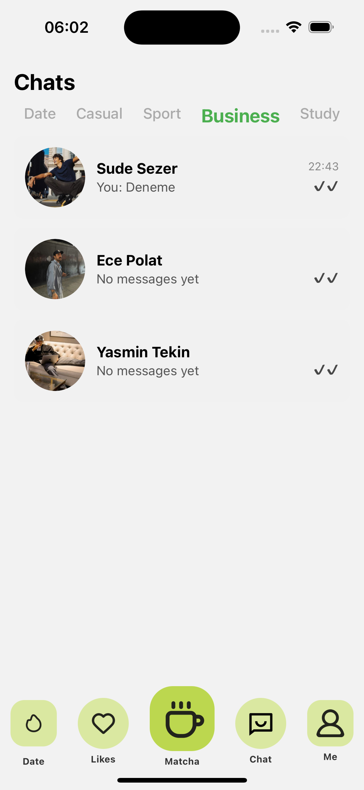
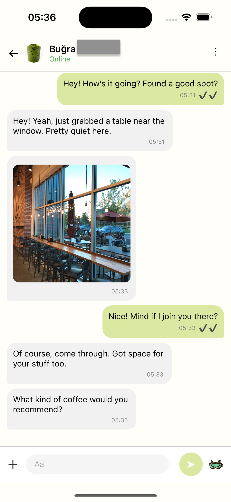
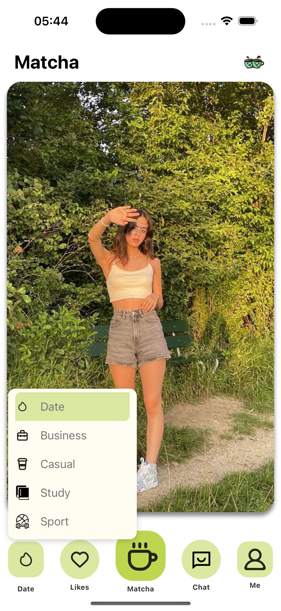

#  Matcha — Social, Dating & Friendship Platform

**Matcha** is an AI-powered social networking app that blends **dating, friendship, and networking** into one experience.  
Users can connect across different modes — **Date, Business, Casual, Study, and Sport** — with smart AI suggestions, real-time chat, and multilingual support.  

---

## ✨ Features
- 👤 **Multi-Mode Profiles** — Switch between Date, Business, Casual, Study, or Sport  
- 🤖 **AI Insights & Helpers** — Conversation starters, smart suggestions, and profile insights  
- 💬 **Real-Time Chat** — Smooth, responsive messaging system with media sharing  
- 🌍 **Global Connections** — Auto-translation and location-based discovery  
- 📊 **Personalized Feed** — Swipe cards, AI prompts, and user interests for authentic connections  

---

## 📸 App Preview

### 🔄 Swipe Cards  
Swipe right to connect, left to pass. AI-generated insights highlight common interests.  

  
  
  

---

### 🧠 AI Insights & Helpers  
Get personalized conversation starters and interest-based insights powered by AI.  

  
  

---

### 📑 Profile Details  
Rich user profiles with bio, interests, and personal highlights.  

  

---

### 💬 Real-Time Chat  
Fast, intuitive chat with image sharing and AI assistance for conversation flow.  

  
  

---

### 🎭 Multiple Modes  
Switch between **Date, Business, Casual, Study, Sport** depending on your intent.  

  

---

## 🚀 Tech Stack
- **Frontend:** React Native  
- **Backend:** .NET (C#) 
- **Database:** PostgreSQL  
- **Realtime:** SignalR WebSockets  
- **AI:** Custom NLP + LLM integrations  
- **Cloud:** AWS + Docker  

---

